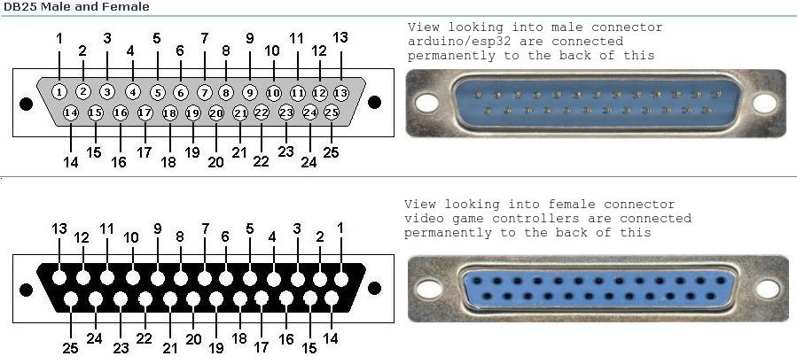

OpenRetroPad
------------

Adapt various input devices to various output devices.

Currently supported inputs: SNES/NES, Sega Genesis/Megadrive/Atari, Playstation (and PS2) Digital and Dual shock, Nintendo 64, Nintendo Gamecube

Currently supported outputs: bluetooth-hid gamepad, usb-hid gamepad, nintendo switch usb gamepad, wireless usb-hid gamepad over radio

Build using [PlatformIO](https://platformio.org/) using `pio run` or `pio run -e $board-$input-$output` for a specific target/env.

env's are laid out like `$board-$input-$output`
supported values:
  * $board: micro, esp32
  * $input: snes, genesis, psx, n64, gc, radio, debug
  * $output: radio, usb, usbradio, switchusb, bt, debug
  * please note not all boards are compatible with all inputs/outputs, for example esp32 can only do bt, micro can only do radio or usb

Wiring
------

(quick plea: if you are good at drawing diagrams, please help!)

| DB-25 Pins    | Arduino Pro Micro GPIO | ESP32 GPIO | RADIO    | SNES   | PSX    |
|---------------|------------------------|------------|----------|--------|--------|
|  1            |  1                     |            | -        | -      | -      |
|  2            |  2                     |            | -        | LATCH  | DATA   |
|  3            |  3                     |            | -        | CLOCK  | CMD    |
|  4            |  4                     |            | -        | -      | ATT    |
|  5            |  5                     |            | -        | -      | CLK    |
|  6            |  6                     |            | -        | -      | -      |
|  7            |  7                     |            | CE       | -      | -      |
|  8            |  8                     |            | CSN      | -      | -      |
|  9            |  9                     |            | -        | -      | -      |
| 10            | 10                     |            | -        | -      | -      |
| 11            |  0                     |            | -        | -      | -      |
| 12            | -                      |            | -        | -      | -      |
| 13            | -                      |            | -        | -      | -      |
| 14            | 14                     |            | MISO     | -      | -      |
| 15            | 15                     |            | SCLK     | -      | -      |
| 16            | 16                     |            | MOSI     | -      | -      |
| 17            | -                      |            | -        | -      | -      |
| 18            | 18                     |            | -        | DATA1  | -      |
| 19            | 19                     |            | -        | DATA2  | -      |
| 20            | 20                     |            | -        | DATA3  | -      |
| 21            | 21                     |            | -        | DATA4  | -      |
| 22            | -                      |            | -        | -      | -      |
| 23            | -                      |            | 3.3V VCC | -      | -      |
| 24            | 5V VCC                 |            | 5V VCC   | 5V VCC | 5V VCC |
| 25            | GND                    |            | GND      | GND    | -      |

Credits / Links
---------------

Code and/or inspiration was (or will be) taken from these places, in no particular order:

  * [ESP32-BLE-Gamepad](https://github.com/lemmingDev/ESP32-BLE-Gamepad)
  * [DaemonBite-Retro-Controllers-USB](https://github.com/MickGyver/DaemonBite-Retro-Controllers-USB)
  * [Arduino-USB-HID-RetroJoystickAdapter](https://github.com/mcgurk/Arduino-USB-HID-RetroJoystickAdapter)
  * [BlueCubeMod](https://github.com/NathanReeves/BlueCubeMod)
  * [OpenSwitchPad](https://github.com/agustincampeny/OpenSwitchPad)
  * [arduino-n64-controller-library](https://github.com/pothos/arduino-n64-controller-library)
  * [N64toiQue](https://github.com/mnzlmstr/N64toiQue)
  * [dreamcast_usb](https://github.com/raphnet/dreamcast_usb)
  * [SNES-NRF24](https://github.com/baldengineer/SNES-NRF24)
  * https://github.com/NicoHood/Nintendo
  * https://github.com/darthcloud/BlueRetro
  * https://github.com/raphnet/gc_n64_usb-v3
